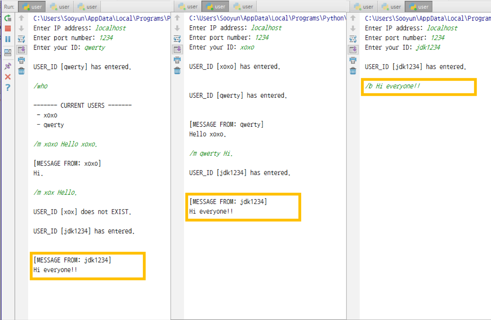
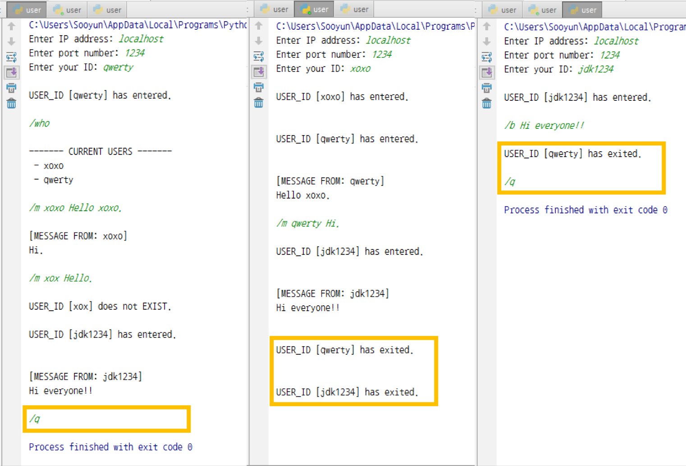

Program Environment: Windows 10

## A Multi-Party Chat Program

A multi-party chat program using socket programming

### **Functionalities**
* Server
	* Accept multiple clients to be connected
	* Receive requests from clients, and handle those requests
	* After running the server, receive a port number from a user
* Client
	* After running the client, receive the server IP address, port number, and user ID
	* When a client connects to the server, the server lets the existing clients know that a new client has joined
	* Commands
		* `/who`: retrieve the user ID list of currently conntected users
{: width="70%" height="70%"}
		* `/m user_ID message`: deliver ***message*** to ***user_ID*** (or show that ***user_ID*** does not exist)
{: width="70%" height="70%"}
		* `/b message`: broadcast ***message*** to all connected users
{: width="70%" height="70%"}
		* `/q`: terminate the client program and let all other users know that the client has left
{: width="70%" height="70%"}

### Design
* Server
	* The `User` class represents each client connected to the server
	* The `User` class saves the socket and user ID of each client, and defines the methods to handle the client's requests
	* The main thread keeps on waiting for the connection of a new client
	* When a client is newly connected, a thread to handle that client's requests is created
* Client
	* The main thread keeps on waiting for a message to send to the server
	* When a message is entered, it is sent to the server through the client's socket
